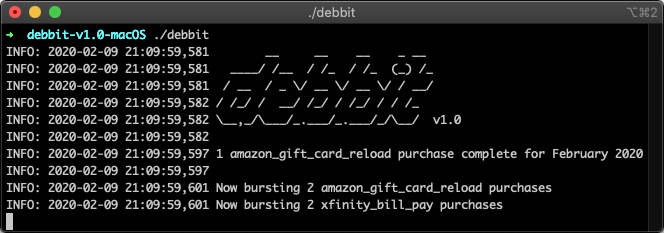

# debbit
**Click pic for video demo [👉](https://i.imgur.com/6TQjwsI.mp4)**

### Download

[macOS and Windows](https://github.com/jakehilborn/debbit/releases). Or, clone the source and run debbit.py.

### Why?

[High interest checking accounts](https://www.doctorofcredit.com/high-interest-savings-to-get/#Mega_High-Interest_Nationwide) offer up to a 5% return on your account balance. To qualify for these high returns, you'll typically need to make 10 to 50 debit card transactions per month depending on each bank's requirements. Debbit automates the spending requirement by programatically buying 50 cent Amazon gift cards and paying bills in small increments throughout each month.

### Debbit currently supports
- Amazon gift card reloads
- Xfinity bill pay
- AT&T bill pay
- Optimum bill bay
- More to come... Please open a GitHub issue with requests for new merchants/bills to support.

### Features
- **Anti account lockout**: Debbit will spread purchases through the month with some randomness in timing and amount spent. These controls prevent Debbit from spamming your accounts with too many transactions too quickly or too similarly.
- **Fault tolerant**: Start up or shut down Debbit at any time. Debbit saves important state to your hard drive and will auto-adjust its spending to fit the time left in the month. It doesn't matter if you start Debbit on the 1st or the 15th of the month, it will adjust its scheduling accordingly.
- **Built in support**: If amazon/xfinity/etc changes their website and Debbit stops working, it will generate error logs to describe the issue. All passwords & cc details are automatically removed from the logs. There is no built-in error uploads so you'll have to email the files or create an Issue on GitHub to share.
- **Private**: There are no analytics or anything uploading data anywhere.

### FAQ:
https://jakehilborn.github.io/debbit/#faq

### Feedback:
Please create a GitHub Issue for any feedback, feature requests, merchant requests bugs, etc. Happy to accept pull requests too!
