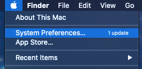
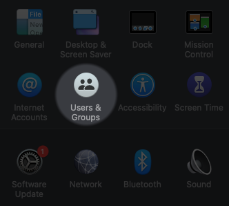
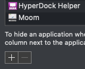
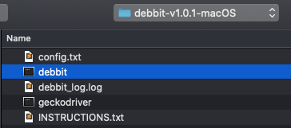
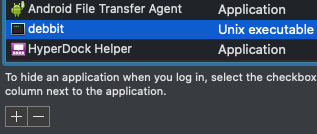

## How to auto run debbit on macOS start up

1. Click the Apple button in the top left corner of your screen, then click `System Prefrences`.  

2. Click `Users & Groups`.  

3. Your user should be highlighted in the left hand navigation bar. Now, click the `Login Items` tab near the top right corner of this window.  

4. Click the `+` button  

5. Find your copy of `debbit`, and select the file named `debbit`. Then click `Add`.  

6. If `debbit` is in the list, you're all done. Go ahead and reboot to try it out. If `debbit` does not show up in the list of login items after adding, try clicking the `Password` tab and then clicking the `Login Items` tab again. It should now be there.  

