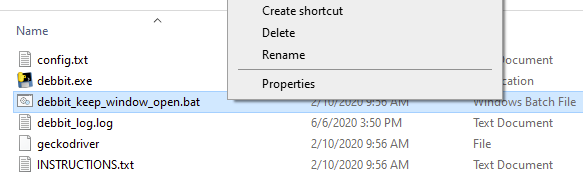
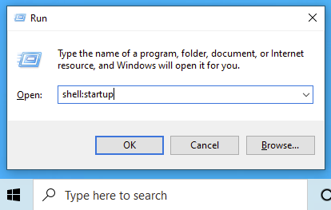
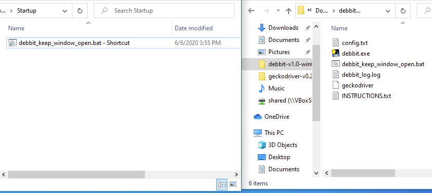

## How to auto run debbit on Windows start up

1. Navigate to the debbit folder using File Explorer.

1. Right click on `debbit_keep_window_open.bat` and click `Create shortcut`.  

{:start="3"}
1. Press the key combo `Windows + r` to bring up the run window. Alternatively, click the start button and type in `run` to bring up the run window.

1. Type in `shell:startup` and click OK.  

{:start="5"}
5. Drag `debbit_keep_window_open.bat - Shortcut` to the newly opened folder.  

{:start="6"}
6. All done! Reboot your computer to test it out.
